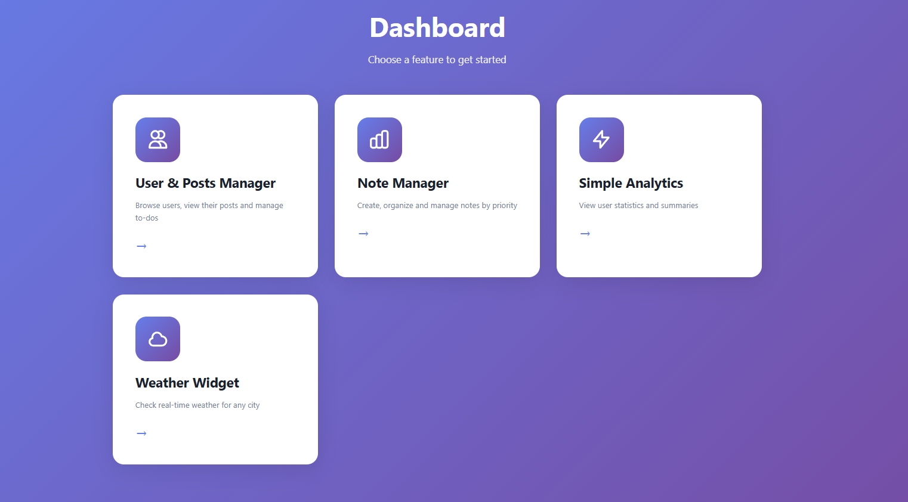
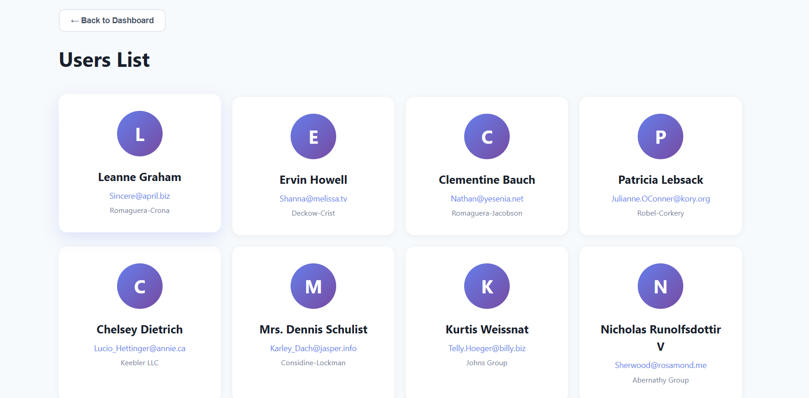
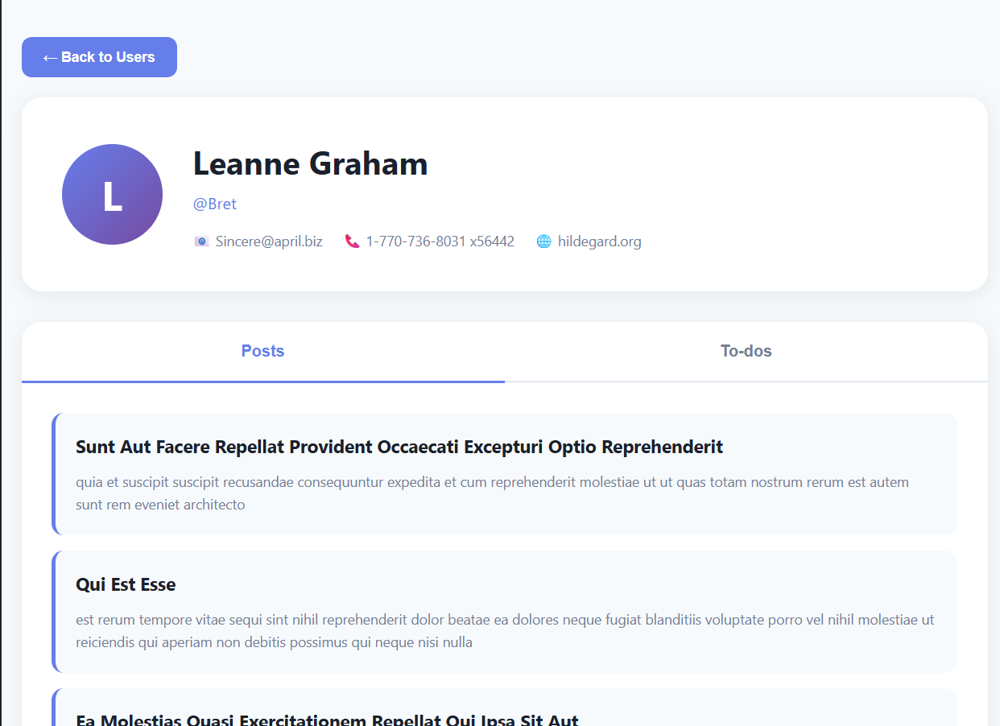
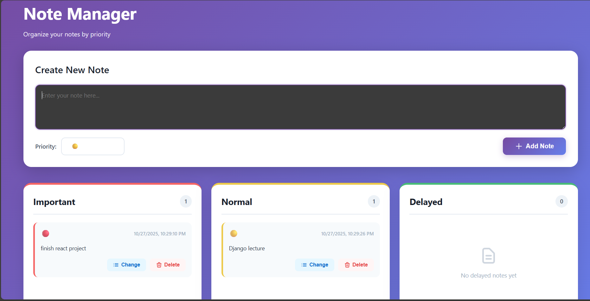
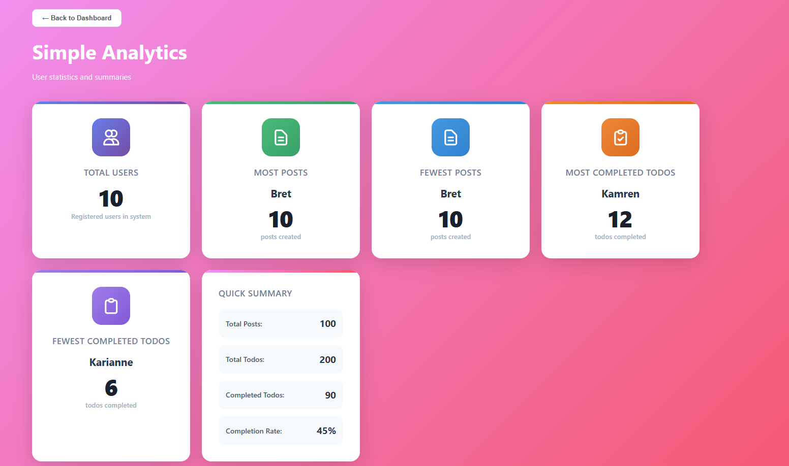
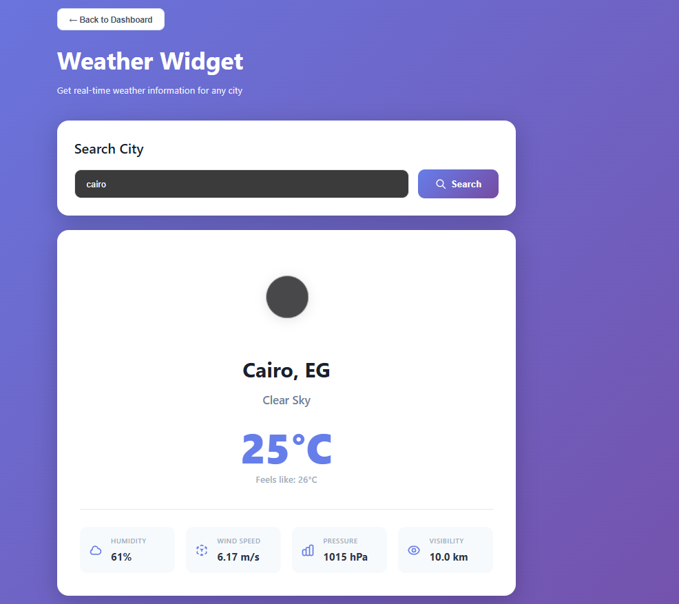

# 🧭 React Dashboard Project

A **React Dashboard Application** featuring authentication, data management, notes organization, analytics, and live weather information.  
Built with modern React concepts like **React Router**, **React Query**, and **Context API **, this project demonstrates component-based architecture and API integration.

---

## 📁 Project Structure
```  
src
┣ assets
┃ ┗ components
┃ ┣ Analytics.css / Analytics.jsx
┃ ┣ DashboardCard.jsx
┃ ┣ NoteCard.jsx / NoteManager.jsx / NoteManager.css
┃ ┣ NoteSection.jsx
┃ ┣ UserDetail.jsx / UserDetail.css
┃ ┣ UserPosts.jsx
┃ ┣ UsersList.jsx / UsersList.css
┃ ┣ UserTodos.jsx
┃ ┣ Weather.jsx / Weather.css
┃ ┗ pages
┃ ┣ Dashboard.jsx / Dashboard.css
┃ ┣ Login.jsx / Login.css
┣ App.jsx / App.css
┣ index.jsx
┣ main.jsx 

```

---

## 🚀 Overview

This project guides you through building a **React + JavaScript** dashboard app with the following features:

1. **Login Authentication**
2. **Dashboard Overview**
3. **User & Posts Manager**
4. **Note Manager**
5. **Analytics Summary**
6. **Weather Widget**

---

## 🧩 Features Breakdown

📸 _Login Page Screenshot_  


📸 _Dashboard Screenshot_  


### 3. 👥 User & Posts Manager
📸 _User List Screenshot_  


📸 _User Details Screenshot_  


### 4. 🗒️ Note Manager
📸 _Note Manager Screenshot_  


### 5. 📈 Simple Analytics
📸 _Simple Analysis Screenshot_  


### 6. 🌦️ Weather Widget
📸 _Weather Widget Screenshot_  



